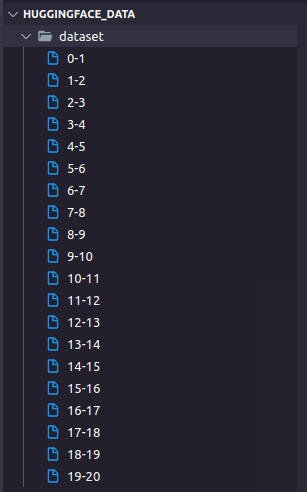

# Text preprocessing

## About data

The raw data is origin from [binhvq-20m-21/05/2021](https://github.com/binhvq/news-corpus#facebook-comment-corpus) and [binhvq-fbcomment](https://github.com/binhvq/news-corpus#facebook-comment-corpus).  
But the data is in mongodb dump format, so i use the jsonl format from my friend, [Thanh Le (Luvata)](https://github.com/Luvata).  
He imported raw data into jsonl data, which can download from [binhvq_news21_raw - huggingface dataset](https://huggingface.co/datasets/imthanhlv/binhvq_news21_raw)  
Below codes are applied with data stored in folder ***dataset***. Each part of dataset is named as below.

## Process step

1. get all body content and save to txt files.  
`python text_process/pre-processing/1_get_body_text.py -i /mnt/sda3/text_data/huggingface_data/dataset -o /mnt/sda1/text_data/1_output -n 6`